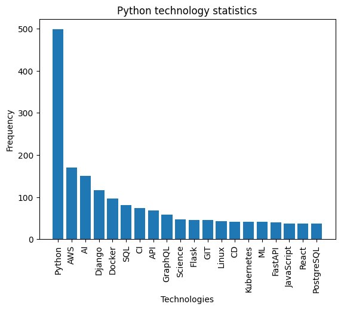

# TechTrendStat
**Technological Trends Statistician** is your go-to tool for real-time insights into the ever-changing technology landscape, combining web scraping and data analysis to track and analyze the latest trends in development job descriptions.

## Features
- [Scraping jobs from Djinni](techtrendscrape/spiders/djinni.py) by several specialization categories (e.g. Python, Java, DevOps, etc.).
- [Mongo client singleton](database/client.py).
- Ability to work with local and cloud MongoDB, as well as with regular CSV files.
- Using [`Pydantic` models](database/models.py) instead of standard items for better data validation.
- [Database templates](database/templates.py) to simplify connection to MongoDB.
- [Two pipelines](techtrendscrape/pipelines.py) (Mongo and CSV).
- [CSV pipeline](techtrendscrape/crawler.py) that covers the entire ETL process.
- [Data Wrangling](techtrendanalysis/wrangler.py). Clean up text and extract technical statistics.

## Linux Installation
> **NOTE:** Python version >3.8 is required.

Clone the repository:
```bash
git clone https://github.com/AndriyKy/tech-trend-stat.git
cd tech-trend-stat
```

Create a virtual environment, install dependencies and set the `PYTHONPATH` environment variable:
```bash
python -m venv .venv
source .venv/bin/activate
pip install -r requirements.txt
export PYTHONPATH="$(pwd):$(pwd)/techtrendanalysis:$(pwd)/techtrendanalysis"
```

Create a copy of the file [`.env.copy`](.env.copy) -> `.env` and set the appropriate variables (in the case of working with MongoDB).

## Getting Started
### MongoDB
If you decide to work with MongoDB, here is a [tutorial](https://sparkbyexamples.com/mongodb/run-mongodb-in-docker-container/) on how to install it locally in a Docker container.

Here is also the [instruction](https://www.mongodb.com/docs/atlas/create-connect-deployments/) on how to create a cluster on the cloud.

Once the database has been successfully installed, you just need to run the following command to scrape the vacancies using the `scrapy` spider:
```bash
scrapy crawl djinni -a categories="Python"
```

You can substitute "Python" for any other category, or a stack of categories separated by a " | ". See available specializations (categories) on the Djinni website.

To extract statistics from job descriptions, run the [`wrangler`](techtrendanalysis/wrangler.py) file, passing the desired category name.

### CSV File
If you can't install MongoDB, just run the [`crawler`](techtrendscrape/crawler.py) script. It will scrape jobs in the category you passed and save them to the appropriate CSV file. After that, it will pull job descriptions from the generated file, extract the technology stack and write it to another CSV file.

## Data Analysis
To see the visualization of the extracted statistics, please, head over to the [`analysis`](techtrendanalysis/analysis.ipynb) file and follow the instructions given there.

Here is an example of a visualized result

